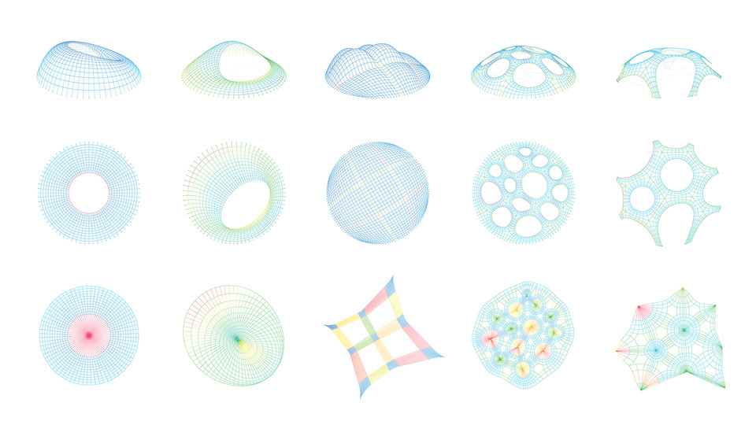

# Summary

Thrust Network Analysis (TNA) is a method rooted in graphic statics that determines the equilibrium form of spatial networks of compressive forces subjected to vertical loads at their nodes. This study introduces a new approach for creating compression-only vaulted surfaces and structural networks. The technique identifies feasible funicular configurations under gravity within a prescribed boundary. By combining projective geometry, duality principles, and linear optimization, it delivers a visual and intuitive framework that retains the benefits of graphic statics while extending them to fully three-dimensional cases. The method can be applied both to the structural assessment of historic vaulted masonry and to the design of modern vaulted systems. This paper presents the approach and illustrates its use through practical examples in both contexts .

# Statement of need

`COMPAS TNA` is a Python package for Thrust Network Analysis within the COMPAS computational framework. Python enables wrapping low-level numerical libraries for speed without losing flexibility or ease-of-use in the user interface. The API for `COMPAS TNA` was designed to provide a class-based and user-friendly interface to efficient implementations of common operations in structural form-finding, including equilibrium computation, force density methods, and interactive vault design [@Rippmann2012].

The package builds upon established theoretical foundations in graphic statics and funicular form-finding [@Block2016]. It provides tools for exploring the solution space of structural design through geometry-based understanding of structures [@VanMele2012]. The implementation supports both educational applications and advanced research in funicular shell design exploration [@Rippmann2013], as illustrated in \autoref{fig:compas-tna}.

`COMPAS TNA` was designed to be used by both structural engineering researchers and students in courses on computational design and structural analysis. The combination of intuitive geometric methods with robust numerical implementations enables accessible yet powerful exploration of compression-only structural systems within the broader COMPAS ecosystem.

<!-- # Mathematics

Single dollars ($) are required for inline mathematics e.g. $f(x) = e^{\pi/x}$

Double dollars make self-standing equations:

$$\Theta(x) = \left\{\begin{array}{l}
0\textrm{ if } x < 0\cr
1\textrm{ else}
\end{array}\right.$$

You can also use plain \LaTeX for equations
\begin{equation}\label{eq:fourier}
\hat f(\omega) = \int_{-\infty}^{\infty} f(x) e^{i\omega x} dx
\end{equation}
and refer to \autoref{eq:fourier} from text. -->

<!-- # Citations

Citations to entries in paper.bib should be in
[rMarkdown](http://rmarkdown.rstudio.com/authoring_bibliographies_and_citations.html)
format.

If you want to cite a software repository URL (e.g. something on GitHub without a preferred
citation) then you can do it with the example BibTeX entry below for @fidgit.

For a quick reference, the following citation commands can be used:
- `@author:2001`  ->  "Author et al. (2001)"
- `[@author:2001]` -> "(Author et al., 2001)"
- `[@author1:2001; @author2:2001]` -> "(Author1 et al., 2001; Author2 et al., 2002)" -->

<!-- # Figures

Figures can be included like this:

and referenced from text using \autoref{fig:compas-tna}.

For a quick reference, the following figure commands can be used:
- `\autoref{fig:compas-tna}` -> "Figure 1"
- `\ref{fig:compas-tna}` -> "1"

Figure sizes can be customized by adding an optional second parameter:
{ width=50% } -->

<!-- # Acknowledgements

We acknowledge contributions from Brigitta Sipocz, Syrtis Major, and Semyeong
Oh, and support from Kathryn Johnston during the genesis of this project. -->

# References